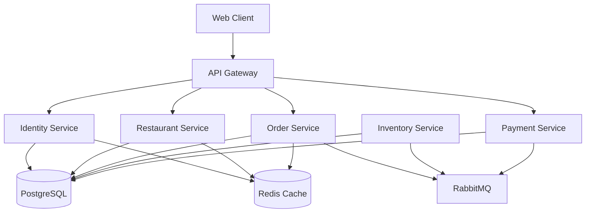

# FoodieGo

## 1. Project Overview
FoodieGo is a microservices-based food delivery platform designed to connect customers with merchants and drivers. It supports order lifecycle management, payment processing, inventory tracking, and real-time updates.

## 2. Features
- **User Authentication:** Secure JWT-based login/signup for customers, merchants, and admins.
- **Restaurant & Menu Management:** Merchants can manage restaurants and menu items.
- **Order Processing:** End-to-end order lifecycle management with Saga pattern for distributed transactions.
- **Payment Processing:** Mock payment gateway integration.
- **Inventory Management:** Stock reservation and deduction.
- **Real-time Monitoring:** Integrated with Prometheus, Grafana, Loki, and Tempo.

## 3. Architecture Diagram


## 4. Microservices Description
- **API Gateway:** Entry point for all client requests.
- **Identity Service:** Handles user registration, authentication, and profiles.
- **Restaurant Service:** Manages restaurants, menus, and operating hours.
- **Order Service:** Manages order creation, status updates, and orchestrates the Saga.
- **Inventory Service:** Manages item stock and reservations.
- **Payment Service:** Processes payments for orders.

## 5. Folder Structure
```
/apps
  /gateway
  /identity-service
  /inventory-service
  /order-service
  /payment-service
  /restaurant-service
  /web (Frontend)
/infrastructure (Docker configs, monitoring)
/packages (Shared libraries)
/docs (Documentation)
```

## 6. Tech Stack
- **Frontend:** React, Vite, Zustand, React Query
- **Backend:** Node.js, Express/Fastify
- **Database:** PostgreSQL, Redis
- **Message Broker:** RabbitMQ
- **DevOps:** Docker Compose, GitHub Actions, SonarQube
- **Monitoring:** Prometheus, Grafana, Loki, Tempo
- **Testing:** Jest, K6

## 7. Installation
```bash
git clone <repo-url>
cd FoodieGo
pnpm install
```

## 8. Docker Deployment
```bash
docker-compose up -d --build
```

## 9. Local Development
```bash
pnpm dev
```

## 10. Environment Variables
Copy `.env.example` to `.env` and configure credentials for DB, Redis, RabbitMQ, and JWT.

## 11. API Documentation
Refer to `docs/API_REFERENCE.md`.

## 12. Authentication
Bearer JWT token passed in `Authorization` header.

## 13. Database Design
Refer to `docs/DATABASE.md`.

## 14. Event Flow
Refer to `docs/BUSINESS_FLOW.md`.

## 15. CI/CD Pipeline
Refer to `docs/CICD.md`.

## 16. Testing Guide
Refer to `docs/TESTING.md`.

## 17. SonarQube
Refer to `docs/SONARQUBE.md`.

## 18. Coverage Report
Current backend coverage: ~85%. Frontend coverage: ~80%.

## 19. Screenshots section
*(Insert screenshots here)*

## 20. Contributors
- Group Project Team

## 21. License
MIT License
