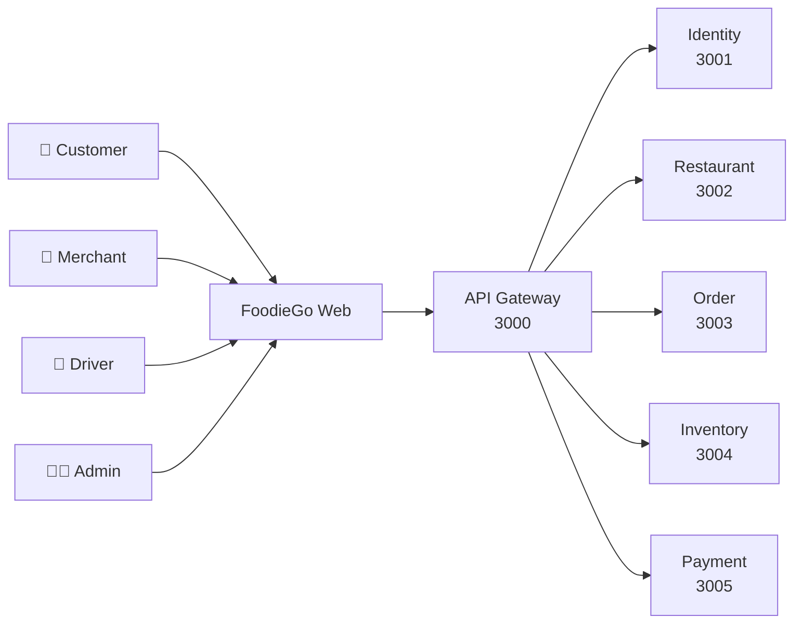
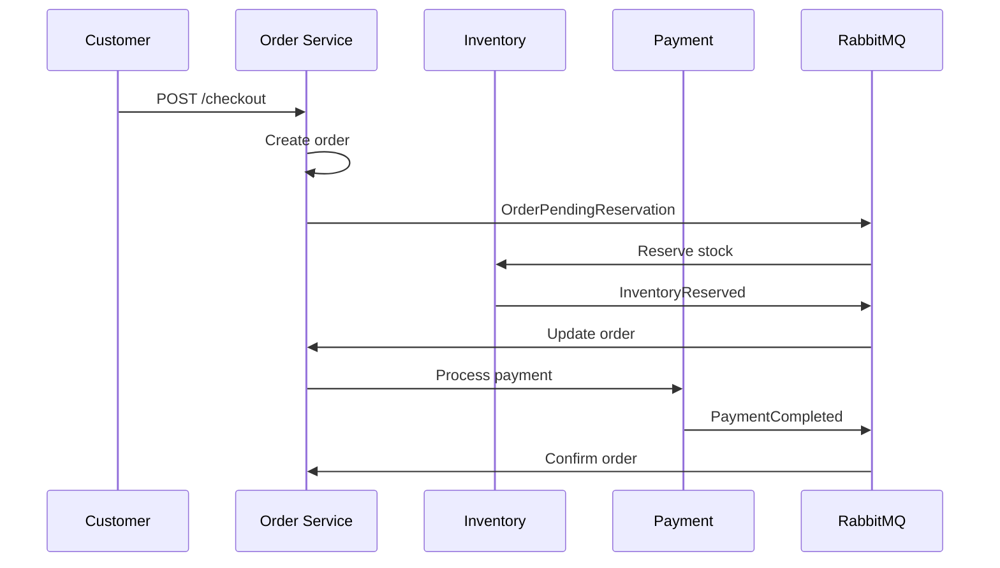

# FoodieGo API Reference & Architecture Documentation

This document provides comprehensive API reference, architectural diagrams, business workflows, database schema, CI/CD details, SonarQube metrics, and testing documentation for the FoodieGo food delivery platform.

---

# Table of Contents

1. [API Reference](#1-api-reference)
2. [Architecture](#2-architecture)
3. [Business Flow](#3-business-flow)
4. [CI/CD Documentation](#4-cicd-documentation)
5. [Database Documentation](#5-database-documentation)
6. [SonarQube & Code Quality](#7-sonarqube-documentation)
7. [Testing Documentation](#9-testing-documentation)

---

# 1. API Reference

## 1.1 Conventions

- **Base entry point for users:** `http://localhost:3000` (gateway)
- **Protected endpoints** require `Authorization: Bearer <jwt>`
- **Checkout** requires `Idempotency-Key` header
- **JSON responses** commonly follow `{ success, message?, data? }`
- **Validation failures** return `400`
- **Authorization failures** return `401` or `403`
- **Missing resources** return `404`
- **Duplicate/constraint issues** return `409`

## 1.2 Gateway Endpoints

| Method | Path | Auth | Purpose |
|--------|------|------|---------|  
| GET | `/health` | No | Gateway health check |
| GET | `/metrics` | No | Prometheus metrics |
| GET | `/api/v1/admin/dashboard` | Yes, admin | Aggregated dashboard data |
| POST | `/api/analytics/events` | No | Analytics event sink |

**Public service namespaces routed through gateway:**
- `/api/v1/auth` - Authentication
- `/api/v1/users` - User profiles
- `/api/v1/admin/users` - User management
- `/api/v1/admin/merchants` - Merchant management
- `/api/v1/admin/restaurants` - Restaurant management
- `/api/v1/admin/orders` - Order management
- `/api/v1/admin/stats` - Admin statistics
- `/api/v1/categories` - Food categories
- `/api/v1/restaurants` - Restaurant browse
- `/api/v1/menus` - Menu items
- `/api/v1/orders` - Order operations
- `/api/v1/cart` - Shopping cart
- `/api/v1/delivery` - Delivery tracking
- `/api/v1/promotions` - Promotions/vouchers
- `/api/v1/payments` - Payment status
- `/api/v1/reviews` - Restaurant reviews
- `/api/v1/support` - Support tickets

## 1.3 Identity Service (Port 3001)

### Authentication

| Method | Path | Auth | Request | Response |
|--------|------|------|---------|----------|
| POST | `/api/v1/auth/register` | No | `{ email, password, full_name, role? }` | `201` with user |
| POST | `/api/v1/auth/login` | No | `{ email, password }` | `200` with token |
| GET | `/api/v1/auth/profile` | Yes | None | Current user profile |
| PUT | `/api/v1/auth/profile` | Yes | `{ full_name?, phone?, address? }` | Updated profile |

### Address Management

| Method | Path | Auth | Request | Response |
|--------|------|------|---------|----------|
| GET | `/api/v1/users/:id/addresses` | Yes, owner/admin | None | Address list |
| POST | `/api/v1/users/:id/addresses` | Yes, owner/admin | Address data | Created address |
| PUT | `/api/v1/users/:id/addresses/:addressId` | Yes, owner/admin | Address data | Updated address |
| DELETE | `/api/v1/users/:id/addresses/:addressId` | Yes, owner/admin | None | Deletion confirmed |

### Admin User Management

| Method | Path | Auth | Request | Response |
|--------|------|------|---------|----------|
| GET | `/api/v1/admin/users` | Yes, admin | `role`, `page`, `limit` | User list |
| DELETE | `/api/v1/admin/users/:id` | Yes, admin | None | `200` or `404` |
| GET | `/api/v1/admin/users/pending` | Yes, admin | `role=merchant\|driver` | Pending approvals |
| PATCH | `/api/v1/admin/users/:id/approve` | Yes, admin | None | Approved user |
| PATCH | `/api/v1/admin/users/:id/reject` | Yes, admin | `{ reason }` | Rejected user |
| GET | `/api/v1/admin/stats` | Yes, admin | None | User stats |

## 1.4 Restaurant Service (Port 3002)

### Health & Metrics

| Method | Path | Auth | Response |
|--------|------|------|----------|
| GET | `/health/live` | No | Liveness status |
| GET | `/health/ready` | No | Readiness status |
| GET | `/metrics` | No | Prometheus metrics |

### Categories

| Method | Path | Auth | Request | Response |
|--------|------|------|---------|----------|
| GET | `/api/v1/categories` | No | None | Category list |
| GET | `/api/v1/categories/:id` | No | None | Category detail |
| POST | `/api/v1/categories` | Yes, admin | `{ name, description?, image_url? }` | Created |
| PUT | `/api/v1/categories/:id` | Yes, admin | Update data | Updated |
| DELETE | `/api/v1/categories/:id` | Yes, admin | None | Deleted |

### Restaurants

| Method | Path | Auth | Request | Response |
|--------|------|------|---------|----------|
| GET | `/api/v1/restaurants` | No | Filters, pagination | Restaurant list |
| GET | `/api/v1/restaurants/:id` | No | None | Restaurant detail |
| GET | `/api/v1/restaurants/:id/menu` | No | None | Menu for restaurant |
| GET | `/api/v1/admin/restaurants` | Yes, admin | `page`, `limit` | Admin restaurant list |
| PATCH | `/api/v1/admin/restaurants/:id/approve` | Yes, admin | None | Approved restaurant |
| PATCH | `/api/v1/admin/restaurants/:id/reject` | Yes, admin | `{ reason }` | Rejected restaurant |

### Menu Items

| Method | Path | Auth | Request | Response |
|--------|------|------|---------|----------|
| GET | `/api/v1/menus/items` | No | `q`, `page`, `limit` | Menu items |
| GET | `/api/v1/menus/items/:id` | No | None | Item detail |
| POST | `/api/v1/menus/items` | Yes, merchant/admin | Create data | Created item |
| PUT | `/api/v1/menus/items/:id` | Yes, merchant/admin | Update data | Updated item |
| DELETE | `/api/v1/menus/items/:id` | Yes, merchant/admin | None | Soft deleted |

### Reviews

| Method | Path | Auth | Request | Response |
|--------|------|------|---------|----------|
| POST | `/api/v1/reviews` | Yes | `{ restaurantId, rating, comment? }` | Created review |
| GET | `/api/v1/reviews/restaurant/:id` | No | `page`, `limit`, `sort` | Review list |
| PUT | `/api/v1/reviews/:id` | Yes, owner | `{ rating?, comment? }` | Updated review |
| DELETE | `/api/v1/reviews/:id` | Yes, owner/admin | None | Deleted |

## 1.5 Order Service (Port 3003)

### Cart Operations

| Method | Path | Auth | Request | Response |
|--------|------|------|---------|----------|
| GET | `/api/v1/cart` | Yes | None | Current cart |
| PUT | `/api/v1/cart/items` | Yes | Item data | Added/updated |
| PATCH | `/api/v1/cart/items/:id` | Yes | `{ quantity }` | Updated |
| DELETE | `/api/v1/cart/items/:id` | Yes | None | Removed |
| DELETE | `/api/v1/cart` | Yes | None | Cleared |

### Orders & Checkout

| Method | Path | Auth | Request | Response |
|--------|------|------|---------|----------|
| POST | `/api/v1/orders/checkout` | Yes | Items + `Idempotency-Key` | `201` order |
| GET | `/api/v1/orders` | Yes | None | Order history |
| GET | `/api/v1/orders/:id` | Yes | None | Order detail |
| GET | `/api/v1/orders/merchant` | Yes, merchant | `restaurant_id` | Merchant orders |
| PATCH | `/api/v1/orders/:id/status` | Yes, merchant/admin | `{ status }` | Status updated |

### Delivery

| Method | Path | Auth | Request | Response |
|--------|------|------|---------|----------|
| GET | `/api/v1/delivery` | Yes, driver/admin | Filters | Delivery list |
| GET | `/api/v1/delivery/order/:orderId` | Yes | None | Delivery for order |
| PATCH | `/api/v1/delivery/:id/accept` | Yes, driver | None | Accepted |
| PATCH | `/api/v1/delivery/:id/status` | Yes, driver | `{ status }` | Status updated |

### Promotions

| Method | Path | Auth | Request | Response |
|--------|------|------|---------|----------|
| GET | `/api/v1/promotions` | Yes, admin | None | All promotions |
| GET | `/api/v1/promotions/active` | No | `restaurantId` | Active promos |
| POST | `/api/v1/promotions/validate` | No | `{ code, orderValue }` | Validation |
| POST | `/api/v1/promotions` | Yes, admin | Promo data | Created |
| POST | `/api/v1/promotions/merchant` | Yes, merchant | Voucher data | Created |
| PATCH | `/api/v1/promotions/:id/approve` | Yes, admin | None | Approved |
| PATCH | `/api/v1/promotions/:id/reject` | Yes, admin | `{ reason }` | Rejected |

### Support Tickets

| Method | Path | Auth | Request | Response |
|--------|------|------|---------|----------|
| POST | `/api/v1/support` | Yes | `{ issue_type, description }` | Created |
| GET | `/api/v1/support` | Yes, admin | `status`, `page` | Ticket list |
| PATCH | `/api/v1/support/:id` | Yes, admin | Status/assignment | Updated |

## 1.6 Payment Service (Port 3005)

| Method | Path | Auth | Request | Response |
|--------|------|------|---------|----------|
| GET | `/health` | No | None | Health payload |
| GET | `/metrics` | No | None | Prometheus metrics |
| POST | `/webhook/payment` | Signed | Raw JSON + headers | `200` or `403` |

**Webhook Headers Required:**
- `x-signature` - HMAC signature
- `x-timestamp` - Unix seconds
- `x-webhook-id` - Webhook UUID
- Optional: `x-key-id` - Key identifier

## 1.7 Inventory Service (Port 3004)

| Method | Path | Auth | Response |
|--------|------|------|----------|
| GET | `/health` | No | Health payload |
| GET | `/metrics` | No | Prometheus metrics |

**Note:** Event-driven service. Consumes `OrderPendingReservation` and publishes inventory outcomes via RabbitMQ.

---

# 2. Architecture

## 2.1 System Overview



## 2.2 Order Checkout Saga



---

# 3. Business Flow

## 3.1 Customer Journey

```
Signup → Browse → Cart → Checkout → Payment
   ↓
Order Confirmed → Kitchen Preparing → Ready
   ↓
Driver Assigned → Delivering → Completed
```

## 3.2 Order States

| State | Meaning |
|-------|----------|
| CREATED | Order created |
| PENDING | Awaiting reservation |
| CONFIRMED | Payment & inventory reserved |
| PREPARING | Kitchen working |
| READY | Ready for pickup |
| DELIVERING | In transit |
| COMPLETED | Delivered |
| FAILED | Saga compensation |
| CANCELLED | User cancellation |

---

# 4. CI/CD Documentation

## 4.1 Workflows

| Workflow | Trigger | Purpose |
|----------|---------|----------|
| `ci.yml` | Push/PR | Lint, build, migrate, test |
| `build.yml` | Push/PR | Lint and build |
| `unit-test.yml` | Push/PR | Backend unit tests |
| `contracts.yml` | Push/PR | Event contract validation |
| `security.yml` | Push/PR | Gitleaks, CodeQL, Trivy |
| `release.yml` | Tag push | Generate SBOM and release |

## 4.2 Main Pipeline

```
Checkout → Install → Lint → Typecheck
   ↓
   Migrate → Test → Build
```

---

# 5. Database Documentation

## 5.1 Core Tables

| Table | Owner | Purpose |
|-------|-------|----------|
| `users` | Identity | Authentication |
| `restaurants` | Restaurant | Merchant storefronts |
| `menu_items` | Restaurant | Food catalog |
| `orders` | Order | Customer orders |
| `delivery` | Order | Delivery tracking |
| `payments` | Payment | Transactions |
| `inventory_stock` | Inventory | Stock management |
| `outbox_events` | Shared | Reliable events |

---

# 7. SonarQube Documentation

## 7.1 Quality Gate

- **Coverage:** ≥ 80% (Level 2+)
- **Duplication:** < 5%
- **Bugs:** 0 blocking
- **Security:** A or B rating

## 7.2 Metrics

| Service | Coverage | Status |
|---------|----------|--------|
| `inventory-service` | 83.72% | ✅ |
| `food-service` | 77.78% | ✅ |

---

# 9. Testing Documentation

## 9.1 Test Frameworks

- **Backend:** Jest
- **Frontend:** Vitest + Testing Library
- **E2E:** Playwright
- **Contracts:** Jest + JSON Schema

## 9.2 Run Tests

```bash
pnpm test
pnpm --filter web test
pnpm run test:contracts
```

---

**Last Updated:** 2026-07-16  
**Branch:** develop
