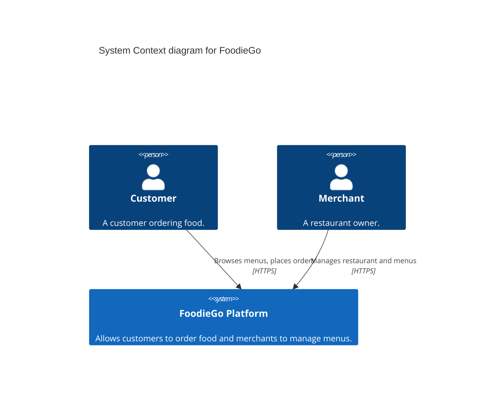
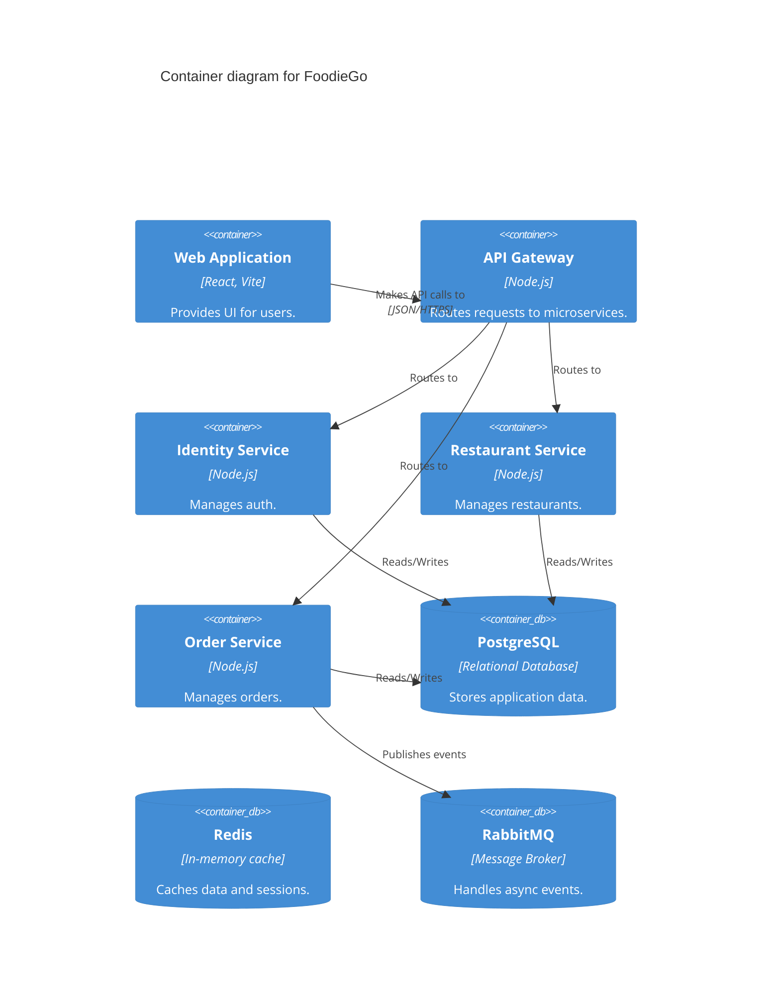
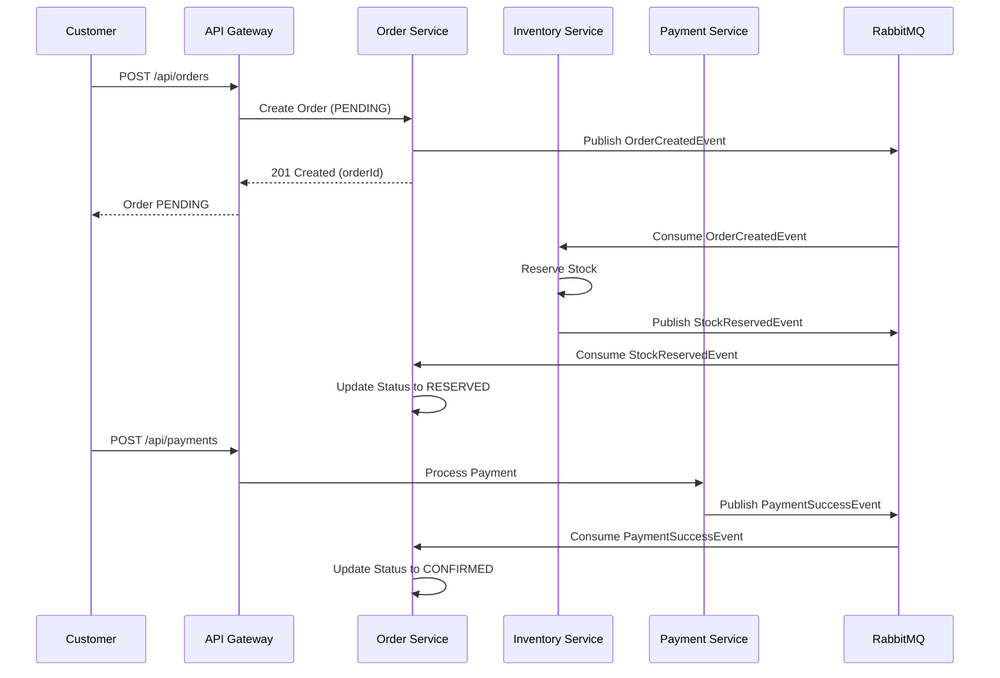
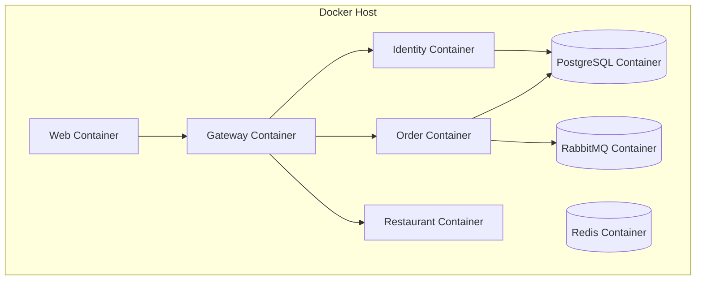

# Architecture

## 1. Context Diagram

```mermaid
C4Context
    title System Context diagram for FoodieGo
    Person(customer, "Customer", "A customer ordering food.")
    Person(merchant, "Merchant", "A restaurant owner.")
    System(foodiego, "FoodieGo Platform", "Allows customers to order food and merchants to manage menus.")
    
    Rel(customer, foodiego, "Browses menus, places orders", "HTTPS")
    Rel(merchant, foodiego, "Manages restaurant and menus", "HTTPS")
```

## 2. Container Diagram

```mermaid
C4Container
    title Container diagram for FoodieGo
    
    Container(web, "Web Application", "React, Vite", "Provides UI for users.")
    Container(gateway, "API Gateway", "Node.js", "Routes requests to microservices.")
    
    Container(identity, "Identity Service", "Node.js", "Manages auth.")
    Container(restaurant, "Restaurant Service", "Node.js", "Manages restaurants.")
    Container(order, "Order Service", "Node.js", "Manages orders.")
    
    ContainerDb(db, "PostgreSQL", "Relational Database", "Stores application data.")
    ContainerDb(redis, "Redis", "In-memory cache", "Caches data and sessions.")
    ContainerDb(rabbitmq, "RabbitMQ", "Message Broker", "Handles async events.")
    
    Rel(web, gateway, "Makes API calls to", "JSON/HTTPS")
    Rel(gateway, identity, "Routes to")
    Rel(gateway, restaurant, "Routes to")
    Rel(gateway, order, "Routes to")
    
    Rel(identity, db, "Reads/Writes")
    Rel(restaurant, db, "Reads/Writes")
    Rel(order, db, "Reads/Writes")
    
    Rel(order, rabbitmq, "Publishes events")
```

## 3. Sequence Diagram: Order Placement

```mermaid
sequenceDiagram
    participant C as Customer
    participant G as API Gateway
    participant O as Order Service
    participant I as Inventory Service
    participant P as Payment Service
    participant R as RabbitMQ
    
    C->>G: POST /api/orders
    G->>O: Create Order (PENDING)
    O->>R: Publish OrderCreatedEvent
    O-->>G: 201 Created (orderId)
    G-->>C: Order PENDING
    
    R->>I: Consume OrderCreatedEvent
    I->>I: Reserve Stock
    I->>R: Publish StockReservedEvent
    
    R->>O: Consume StockReservedEvent
    O->>O: Update Status to RESERVED
    
    C->>G: POST /api/payments
    G->>P: Process Payment
    P->>R: Publish PaymentSuccessEvent
    
    R->>O: Consume PaymentSuccessEvent
    O->>O: Update Status to CONFIRMED
```

## 4. Deployment Diagram

```mermaid
graph TD
    subgraph Docker Host
        web[Web Container]
        gateway[Gateway Container]
        identity[Identity Container]
        order[Order Container]
        restaurant[Restaurant Container]
        
        postgres[(PostgreSQL Container)]
        redis[(Redis Container)]
        rabbitmq[(RabbitMQ Container)]
        
        web --> gateway
        gateway --> identity
        gateway --> order
        gateway --> restaurant
        
        identity --> postgres
        order --> postgres
        order --> rabbitmq
    end
```
