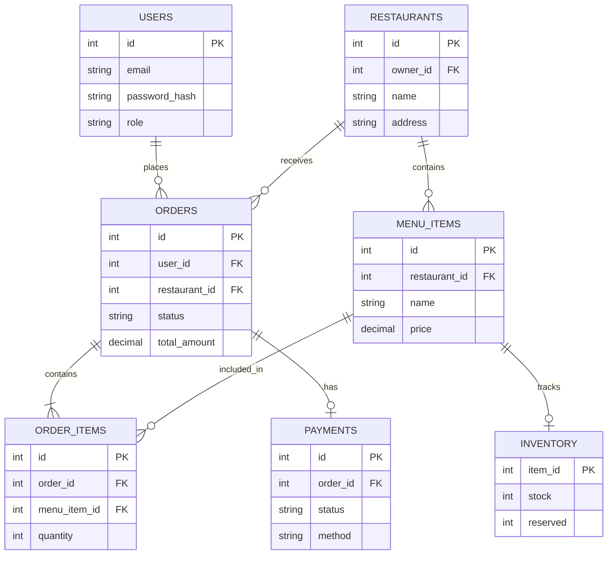

# Database Documentation

## 1. ER Diagram

## 2. Table Ownership (Microservices)
- **Identity Service:** Owns `USERS` table.
- **Restaurant Service:** Owns `RESTAURANTS`, `MENU_ITEMS` tables.
- **Order Service:** Owns `ORDERS`, `ORDER_ITEMS` tables.
- **Payment Service:** Owns `PAYMENTS` table.
- **Inventory Service:** Owns `INVENTORY` table.

## 3. Relationships
- Foreign keys are enforced logically across services, but strictly within the same database schema where applicable.
- In a true microservice distributed database, foreign keys across services are not enforced by the DB but by API composition. Here they exist in a shared PostgreSQL for simplicity.

## 4. Indexes
- `USERS`: `email` (Unique Index)
- `ORDERS`: `user_id`, `restaurant_id`, `status`
- `MENU_ITEMS`: `restaurant_id`

## 5. Constraints
- Prices and amounts must be non-negative.
- Stock cannot fall below 0.
