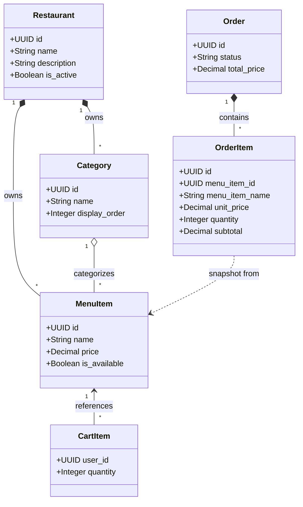
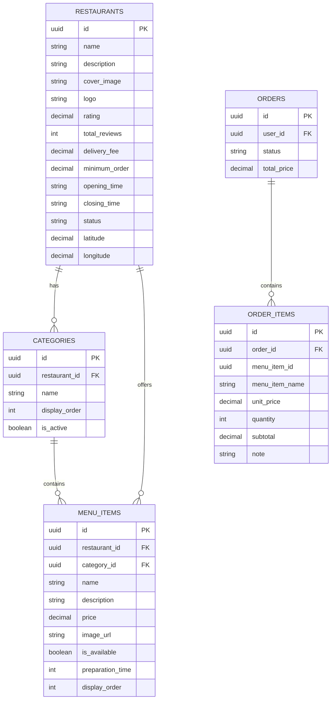

# FoodieGo Domain Documentation

## Ubiquitous Language
Ngôn ngữ chung (Ubiquitous Language) được sử dụng để giao tiếp giữa cả Business, Product và Engineering, đảm bảo một từ vựng nhất quán xuyên suốt codebase và document.

| Term | Definition |
| --- | --- |
| **Restaurant** | (Aggregate Root) Thực thể cốt lõi, đại diện cho một cửa hàng/nhà hàng. Mọi thao tác trên Menu đều xuất phát từ Restaurant. |
| **Category** | (Entity) Cách phân nhóm các món ăn bên trong một Restaurant (ví dụ: Đồ uống, Món chính). Không tồn tại độc lập ngoài Restaurant. |
| **MenuItem** | (Entity) Đại diện cho một Món ăn cụ thể được bán, thuộc về một Restaurant và một Category. |
| **ModifierGroup** | (Entity - Tương lai) Tập hợp các tùy chọn bổ sung cho món (ví dụ: "Chọn Size", "Topping"). |
| **ModifierOption** | (Entity - Tương lai) Tùy chọn chi tiết trong ModifierGroup (ví dụ: "Size L", "Trân châu trắng"). |
| **Order** | (Aggregate Root) Đại diện cho một đơn đặt hàng của Customer. |
| **OrderItem** | (Snapshot Value Object) Một mục trong Order, lưu trữ bản sao giá trị tại thời điểm đặt (tên, giá) để bất biến khi MenuItem thay đổi. |
| **CartItem** | (Entity) Một mục trong Giỏ hàng của Customer, liên kết sống (live reference) tới MenuItem. |

## Domain Diagram

## Entity Relationship Diagram (ERD)

