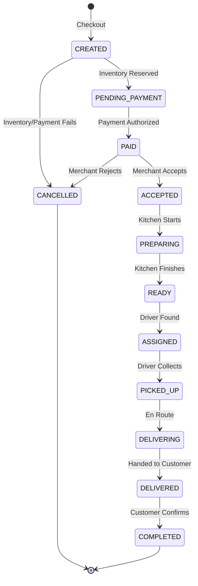
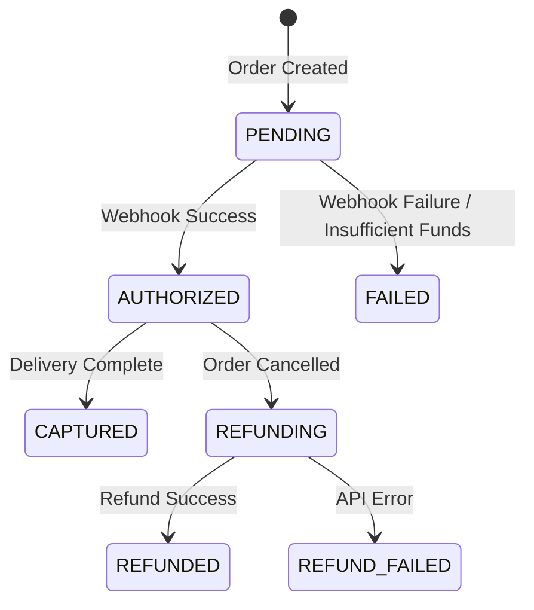
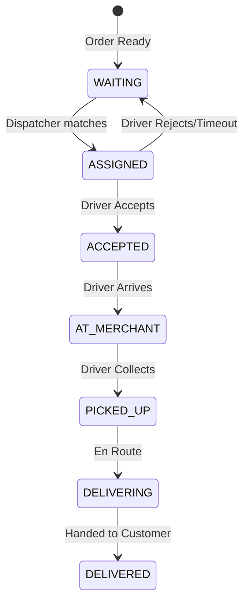
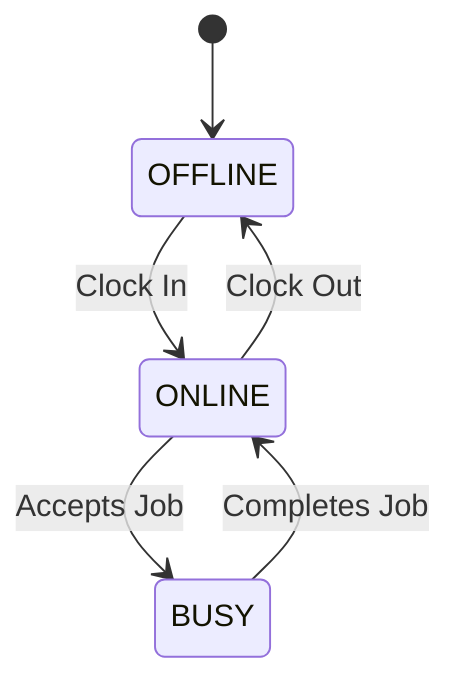

# State Machines

Visual state diagrams for core entities. All state transitions must be strictly validated.

## Order State Machine

## Payment State Machine

## Delivery Lifecycle (Driver Service)

## Driver Status

