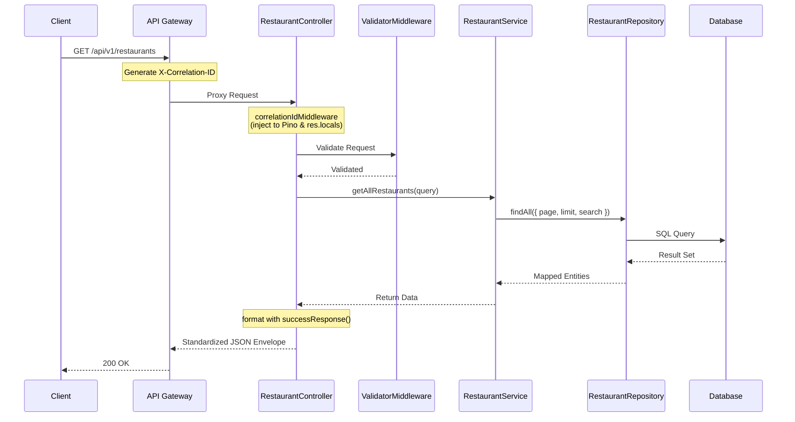

# Milestone 1: API Foundation - Architecture Review

## 1. Overview
Milestone 1 introduces a centralized `packages/core` platform layer to enforce architectural rules across all FoodieGo microservices. This guarantees standardization in Error Handling, Logging, Validation, and Response formatting.

## 2. Request Flow (Sequence Diagram)

## 3. Key Components
- **`@foodiego/core`**: The shared NPM workspace package containing `logger`, `errors`, `response`, `config`, and `middleware`.
- **API Versioning**: Enforced `/api/v1` prefixing across all internal service routes and Gateway routing.
- **Health Probes**: Implemented Kubernetes-compliant `/live`, `/ready`, `/health`, and `/version` endpoints.
