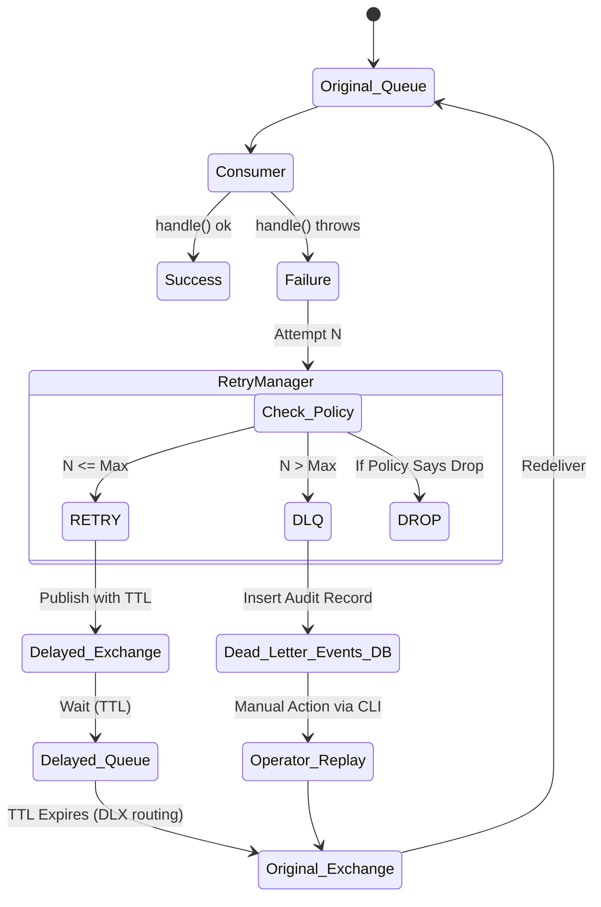

# Retry Timeline & Strategy

## Retry Lifecycle

## Retry Policies
Mapped dynamically in `packages/events/config/retry.policy.json`.
- **Reliable**: 5 retries (1s, 5s, 30s, 1m, 5m) -> DLQ.
- **Fast**: 2 retries (2s, 10s) -> Drop (No DLQ).
- **Payment**: 10 retries (Up to 30 mins) -> DLQ.
