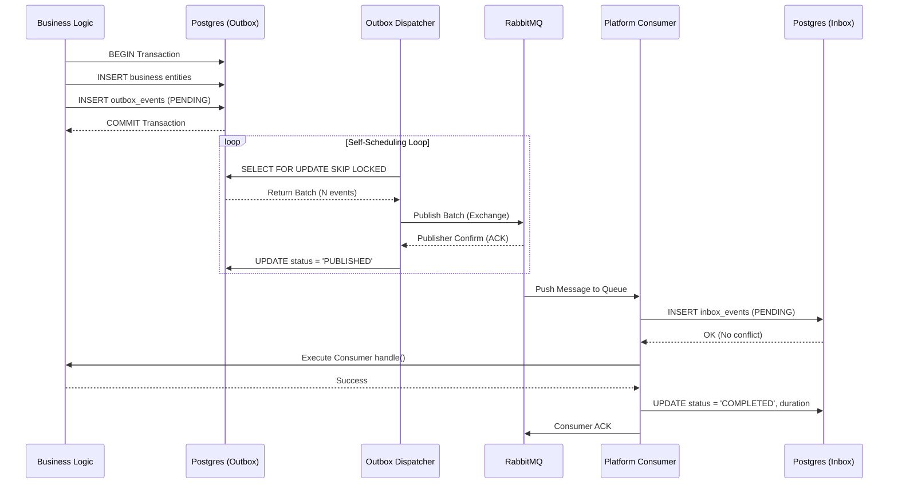
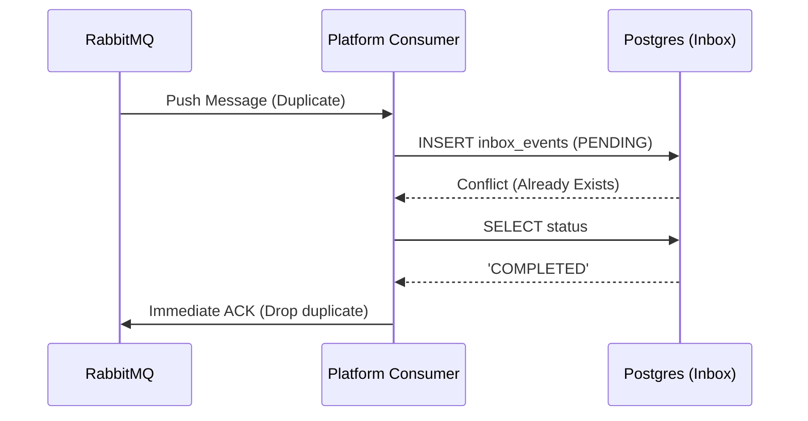

# Sequence Diagrams

## 1. Happy Path: Outbox -> Dispatcher -> RabbitMQ -> Consumer

```mermaid
sequenceDiagram
    participant B as Business Logic
    participant DB as Postgres (Outbox)
    participant D as Outbox Dispatcher
    participant RMQ as RabbitMQ
    participant C as Platform Consumer
    participant I as Postgres (Inbox)
    
    B->>DB: BEGIN Transaction
    B->>DB: INSERT business entities
    B->>DB: INSERT outbox_events (PENDING)
    DB-->>B: COMMIT Transaction
    
    loop Self-Scheduling Loop
        D->>DB: SELECT FOR UPDATE SKIP LOCKED
        DB-->>D: Return Batch (N events)
        D->>RMQ: Publish Batch (Exchange)
        RMQ-->>D: Publisher Confirm (ACK)
        D->>DB: UPDATE status = 'PUBLISHED'
    end
    
    RMQ->>C: Push Message to Queue
    C->>I: INSERT inbox_events (PENDING)
    I-->>C: OK (No conflict)
    C->>B: Execute Consumer handle()
    B-->>C: Success
    C->>I: UPDATE status = 'COMPLETED', duration
    C->>RMQ: Consumer ACK
```

## 2. Exactly-Once Delivery (Inbox Pattern)

```mermaid
sequenceDiagram
    participant RMQ as RabbitMQ
    participant C as Platform Consumer
    participant I as Postgres (Inbox)
    
    RMQ->>C: Push Message (Duplicate)
    C->>I: INSERT inbox_events (PENDING)
    I-->>C: Conflict (Already Exists)
    C->>I: SELECT status
    I-->>C: 'COMPLETED'
    C->>RMQ: Immediate ACK (Drop duplicate)
```
