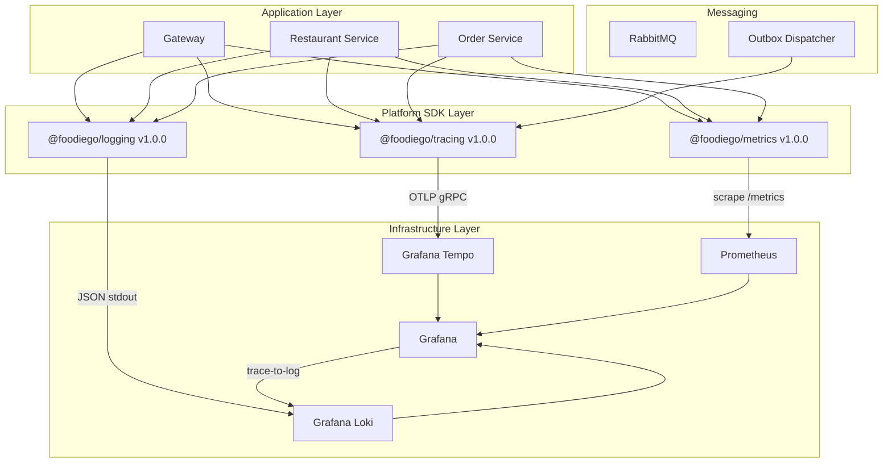
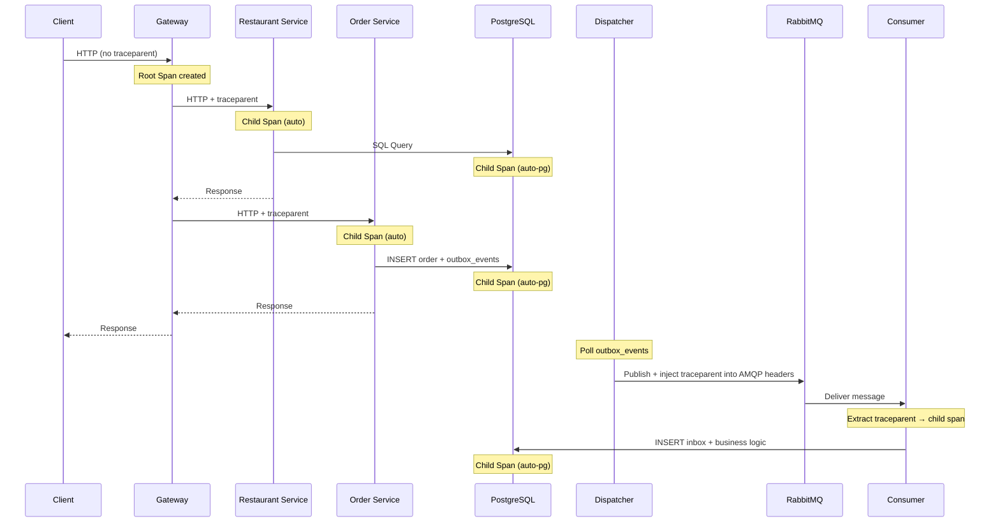

# Observability Foundation — Beta Evidence: Architecture

## Capability Architecture

## Context Propagation Flow

## Key Design Decisions

| Decision | Rationale |
|---|---|
| W3C `traceparent` for all boundaries | Industry standard, vendor neutral |
| Pino + OTel mixin for logging | Auto-inject traceId without developer effort |
| MetricsRegistry (centralized) | Prevent ad-hoc metric creation and high cardinality |
| PII Redaction in SDK | Defense in depth — never trust developers to remember |
| Cost toggles (ENV) | Allow disabling telemetry without redeployment |
| Dashboard as Code (JSON) | Reproducible, version-controlled, no manual UI changes |
